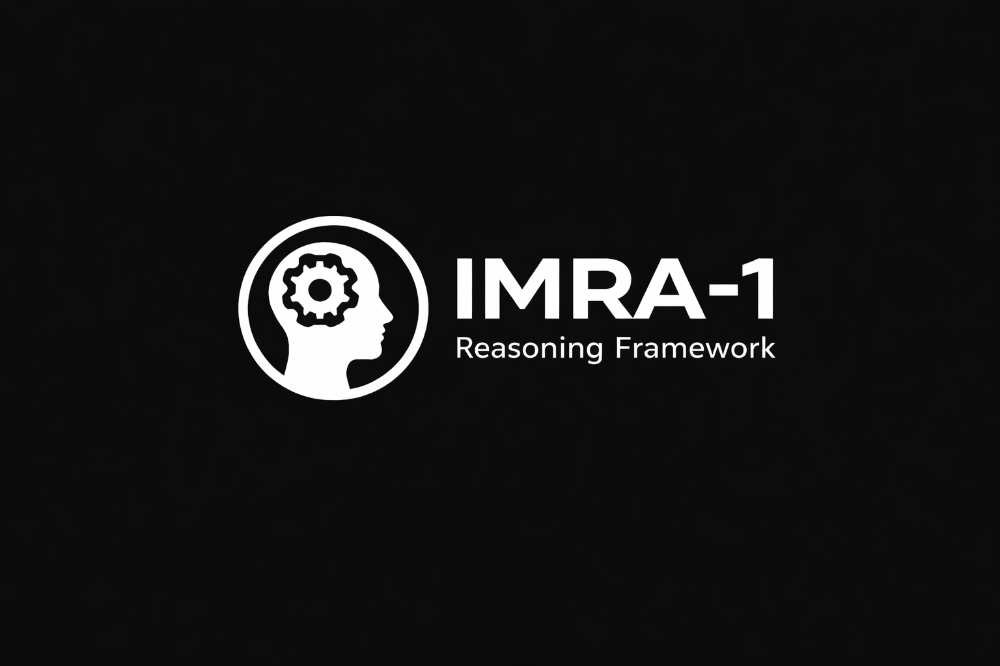

# IMRA-1: Metacognitive Reasoning Framework

[](https://www.python.org/downloads/)
[](https://www.gnu.org/licenses/gpl-3.0)
[]()
[](https://github.com/psf/black)

<p align="center">
  
</p>

IMRA-1 is a framework that teaches AI to **think about its own thinking**. Rather than just producing answers, IMRA-1 analyzes its reasoning process to detect failures, calibrate confidence, and know when it doesn't know.

## What Makes IMRA-1 Different

Most AI systems output an answer and a confidence score. The problem? They're often confidently wrong.

IMRA-1 adds a **metacognitive layer** that:
1. Analyzes the reasoning trace for internal consistency

2. Detects specific failure modes (circular reasoning, verification paradox, etc.)
3. Calibrates confidence based on coherence: `calibrated_conf = raw_conf * coherence`
4. Retries with targeted feedback when coherence is low
5. Refuses to be confident when reasoning is incoherent

## Current Status: Research Prototype

**Honest assessment of where we are:**

| Metric | Result | Notes |
|--------|--------|-------|
| Math problem accuracy | 0% (0/10) | Using small local LLMs (qwen, codellama) |
| Failure mode detection | Working | Correctly identifies verification paradox, circular reasoning, etc. |
| Confidence calibration | Working | Reduces overconfidence on wrong answers |
| Feedback loop | Implemented | Retries with targeted guidance based on detected failure |

It important to clarify that the framework **detects reasoning failures** but can't fix them if the underlying LLM doesn't have the capability. Think of it as a smoke detector - it tells you there's a problem, but can't put out the fire.

## Architecture

### The Four Layers

- **PERCEIVE**: Analyzes the problem, identifies approach, flags uncertainties

- **REASON**: Solves the problem step by step
- **VERIFY**: Checks the solution, finds errors, proposes corrections
- **DISCUSS**: Multi-agent debate to challenge assumptions
- **RESOLVE**: Forces concrete answer after discussion

### Gestalt Coherence

The key innovation. Computes a coherence score from:
- Shannon entropy of confidence progression

- Error density (errors found vs steps taken)
- Confidence mismatch (raw confidence vs verification agreement)

```python
Coherence = 0.4 * (1 - entropy) + 0.3 * (1 - error_density) + 0.3 * (1 - confidence_mismatch)
```

### Failure Modes Detected

| Mode | Description |
|------|-------------|
| **Verification Paradox** | Says answer is wrong but can't find specific errors |
| **Circular Reasoning** | Uses conclusion to prove itself |
| **Incomplete Reasoning** | Gaps in logic, doesn't reach concrete answer |
| **Meta-Retreat** | Explains methodology instead of solving |
| **Healthy** | Reasoning structure is sound |

## Installation

```bash
git clone https://github.com/n-dlms/IMRA-1.git
cd IMRA-1

python -m venv .venv
source .venv/bin/activate

pip install -e .

# See: https://ollama.com

ollama pull qwen2.5-coder:3b
ollama pull qwen2.5-coder:7b
ollama pull codellama:latest
```

## Quick Demo

```bash
python examples/demo.py
```

This runs a simple problem and shows:
- Raw confidence vs calibrated confidence

- Detected failure mode
- Coherence score

## Running Validation

```bash

python run_validation_suite.py

# Resume from specific problem (e.g Problem 5)

python run_validation_suite.py --start-from 5
```

## Project Structure

```
├── src/imra/
│   ├── core/
│   │   ├── orchestrator.py   # Main reasoning loop + feedback
│   │   ├── layers.py         # PERCEIVE, REASON, VERIFY, DISCUSS, RESOLVE
│   │   ├── gestalt.py        # Coherence analysis + failure detection
│   │   └── trace.py          # Cognitive trace logging
│   └── llm/                   # LLM client abstractions
├── examples/
│   └── demo.py               # Quick demonstration
├── datasets/
│   └── hard_math_problems.json
├── research_data/            # Validation results and traces
└── tests/
```

## Key Files

- [orchestrator.py](src/imra/core/orchestrator.py) - The metacognitive feedback loop

- [gestalt.py](src/imra/core/gestalt.py) - Coherence scoring and failure detection
- [layers.py](src/imra/core/layers.py) - The four reasoning phases

## What This Framework Is NOT

- **Not a math solver** - The underlying LLMs determine accuracy

- **Not magic** - Can't fix fundamentally wrong reasoning
- **Not production-ready** - Research prototype for exploring metacognition

## What This Framework IS

- **A metacognitive scaffold** - Adds self-awareness to any LLM pipeline

- **A diagnostic tool** - Identifies *why* reasoning fails
- **A confidence calibrator** - Reduces overconfidence on wrong answers
- **A research platform** - For studying AI self-reflection

## Future Directions (Some considerations I have in mind)

1. **Better base models** - Test with stronger LLMs (GPT-4, Claude, DeepSeek V3.2 etc.)

2. **Training from traces** - Use failure diagnostics to fine-tune models
3. **Ensemble methods** - Multiple coherence estimators for robustness
4. **Human-in-the-loop** - Surface low-coherence answers for review

## Citation

If you use IMRA-1 in your research:

```bibtex
@software{imra1,
  title = {IMRA-1: Metacognitive Reasoning Framework},
  author = {Ntokozo Dlamini},
  year = {2026},
  url = {https://github.com/n-dlms/IMRA-1}
}
```

## License

GNU General Public License v3.0 - See [LICENSE](LICENSE)
